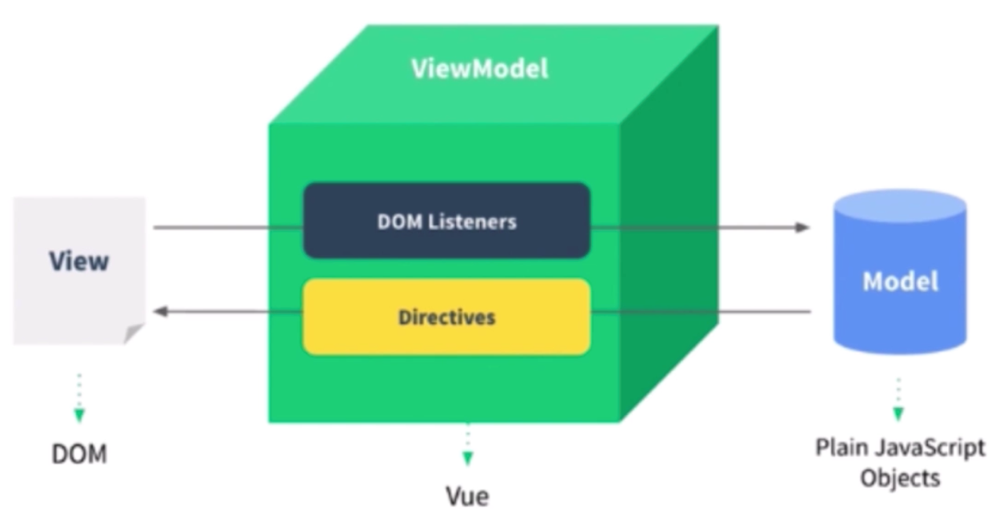

# Vue 原理

## 组件化基础

- “很久以前”就有组件化
  - asp、jsp、php 已经有组件化了
  - nodejs 中也有类似的组件化
- 数据驱动视图（MVVM，setState）
  - 传统组件，只是静态渲染，更新还要依赖于操作 DOM
  - 数据驱动视图——Vue MVVM
  - 数据驱动视图——React setState

### Vue MVVM



```html
<template>
  <div id="app">
    <p @click="changeName">{{ name }}</p>
    <ul>
      <li v-for="(item, index) in list" :key="index">
        {{ item }}
      </li>
    </ul>

    <button @click="addItem">添加一项</button>
  </div>
</template>
```

```typescript
import { Vue, Component } from 'vue-property-decorator';

@Component
class App extends Vue {
  name = 'Vue';

  list = ['a', 'b', 'c'];

  changeName() {
    this.name = 'Vue3';
  }

  addItem() {
    this.list.push(`${Date.now()}`);
  }
}

export default App
```

**总结**

- 组件化
- 数据驱动视图
- MVVM

## Vue 响应式

- 组件 data 的数据一旦变化，立刻触发视图的更新
- 实现数据驱动视图的第一步
- 考察 Vue 原理的第一题
- 核心 API——`Object.defineProperty`
- `Object.defineProperty` 的一些缺点（Vue3 启用 Proxy）

### Proxy 有兼容性问题

- Proxy 兼容性不好，且无法 polyfill
- Vue2.x 还会存在一段时间，所有都得学

### Object.defineProperty 基本用法

```typescript
const data = {};
let name = 'vue';

Object.defineProperty(data, 'name', {
  get: function () {
    console.log('get');
    return name
  },
  set: function (val) {
    console.log('set');
    name = val;
  }
});

// 测试
console.log(data.name); // get vue
data.name = 'vue3'; // set
```

### Object.defineProperty 实现响应式

- 监听对象，监听数组
- 复杂对象，深度监听
- 几个缺点

### Object.defineProperty 缺点

- 深度监听，需要递归到底，一次性计算量大
- 无法监听新增属性/删除属性（Vue.set Vue.delete）